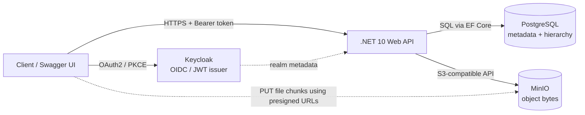
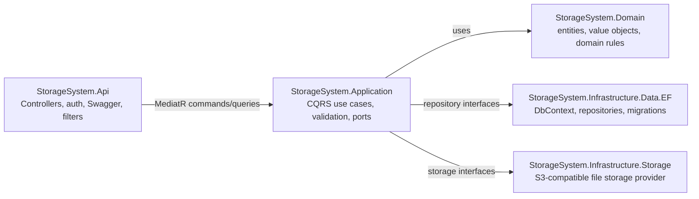
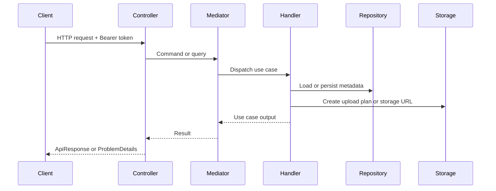
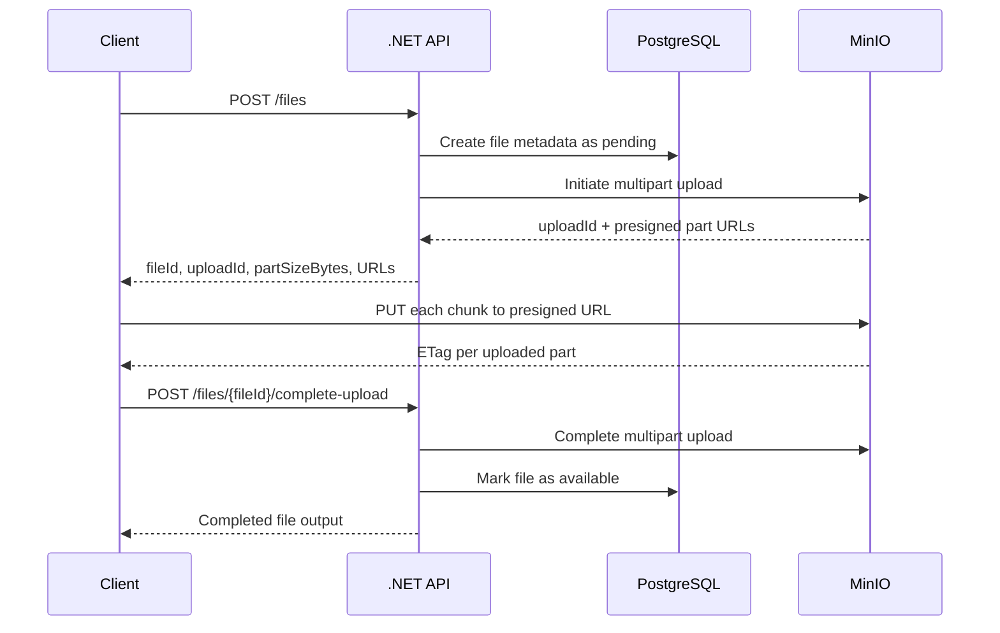

# Architecture

This document describes the backend architecture, dependency boundaries, CQRS flow, and infrastructure responsibilities.

## Overview

The backend follows a layered architecture with explicit boundaries between HTTP concerns, application use cases, domain rules, and infrastructure integrations. The API layer receives authenticated HTTP requests, the application layer coordinates commands and queries through MediatR, the domain layer owns business concepts, and infrastructure projects implement persistence and object storage integrations.

## Runtime Context



The browser or API client stays outside the Docker Compose runtime. Docker Compose runs the API, Keycloak, PostgreSQL, and MinIO for local development.

## Logical Layers



## Dependency Rules

- **Domain** contains business entities and domain exceptions. It does not depend on API, persistence, storage, or authentication frameworks.
- **Application** contains use cases, commands, queries, validators, and interfaces required by the use cases.
- **Infrastructure Data** implements persistence concerns using EF Core and PostgreSQL.
- **Infrastructure Storage** implements object storage concerns using MinIO/S3-compatible APIs.
- **API** composes the application, configures authentication, exposes controllers, maps errors, and hosts Swagger.

## CQRS Flow

Commands and queries are modeled per use case and dispatched through MediatR.

- **Commands** mutate system state, such as creating folders, creating file metadata, completing uploads, and deleting resources.
- **Queries** read system state, such as listing folder contents and generating download information.
- **Validators** protect use case inputs before domain or infrastructure work is executed.
- **Handlers** orchestrate repositories, storage providers, and domain entities.



## Multipart Upload Flow



The API does not receive the file bytes during chunk upload. It creates metadata and upload plans, then completes the upload after the client sends back the uploaded part identifiers.

## Authentication and User Mapping

Keycloak owns authentication. The API validates JWT tokens and maps the authenticated external identity to an internal domain user.

```text
ExternalProvider = keycloak
ExternalSubject  = token sub claim
```

This keeps credentials outside the API while preserving stable ownership relationships inside the domain model.

## Error Handling

The API maps known domain and application failures to `ProblemDetails` responses through a global exception filter.

- Validation failures return client error responses.
- Missing resources return not found responses.
- Business conflicts return conflict responses.
- Unexpected exceptions return server error responses.

## Testing and CI

The solution separates verification by scope:

- **Unit tests:** domain and application behavior.
- **Integration tests:** persistence and use case integration.
- **End-to-end tests:** HTTP API behavior with test infrastructure.
- **GitHub Actions:** restore, build, and test validation for the backend solution.
